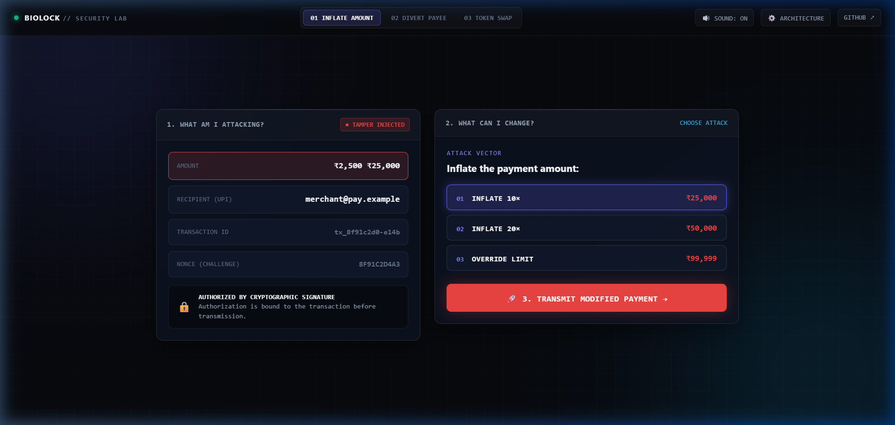

<div align="center">


<br/>

# ISHITA CHAURASIA

### Backend Systems · Security · Fintech

> *I build systems where software meets security, scale, and human behavior.*

<br/>

`BUILD` &nbsp;→&nbsp; `BREAK` &nbsp;→&nbsp; `MEASURE` &nbsp;→&nbsp; `UNDERSTAND` &nbsp;→&nbsp; `IMPROVE`

<br/>

[`⚡ PLAY WITH THE SYSTEMS`](#--play-with-the-systems) &nbsp;·&nbsp; [`ABOUT ME`](#02--about-me) &nbsp;·&nbsp; [`BIOLOCK`](#03--featured-systems) &nbsp;·&nbsp; [`HIRINGRADAR`](#03--featured-systems) &nbsp;·&nbsp; [`LEETCODE`](https://leetcode.com/u/ishita1106/) &nbsp;·&nbsp; [`LINKEDIN`](https://linkedin.com/in/ishitachaurasia) &nbsp;·&nbsp; [`EMAIL`](mailto:ishita20004@gmail.com)

<br/>

```text
┌─────────────────────────────────────────────────────────────────────────────────┐
│                                                                                 │
│   TRANSACTION        AUTHORIZATION        CRYPTOGRAPHY        VERIFICATION      │
│  [ ₹2,500 Payee ] ──> [ P-256 Nonce ] ──> [ Canonical ]  ──>  [ Fail-Closed ]   │
│                             │             [  SHA-256   ]             │          │
│                             └─────────────> ECDSA Der  ──────────────┘          │
│                                                                                 │
└─────────────────────────────────────────────────────────────────────────────────┘
```

</div>

<br/>


## ⚡ PLAY WITH THE SYSTEMS

> *Can you alter the transaction without getting caught?*

<div align="center">

<a href="https://ishcares.github.io/ishcares/lab/">
  
</a>

<br/><br/>

### [⚡ LAUNCH CHALLENGE: BREAK BIOLOCK ↗](https://ishcares.github.io/ishcares/lab/)
**“Intercept an in-flight transfer. Change the payment. See if the server catches you.”**

<sub>No login · ~45 seconds · Interactive client-side ECDSA (P-256) evaluation · Keyboard & mobile friendly</sub>

</div>

<br/>

```text
  01  INTERCEPT    Intercept an authorized in-flight payment card.
  02  TAMPER       Inflate the amount (₹2,500 → ₹25,000) or divert the recipient UPI.
  03  TRANSMIT     Transmit the modified payment to the settlement pipeline.
  04  VERIFY       Watch the cryptographic fingerprint shatter as BioLock fails closed.
```

<div align="center">
  <a href="https://ishcares.github.io/ishcares/lab/">
    
  </a>
</div>

<br/>


## 02 / ABOUT ME

<table>
<tr>
<td width="50%" valign="top">

### *“I’m interested in the space where software has consequences.”*

I started gravitating toward backend engineering because I like the part of software that quietly makes everything else work.

I’m especially drawn to security and fintech because a small assumption can become a very real failure when money or trust is involved.

I like building, breaking, measuring, and going back to understand what I missed.

<br/>

<sub>Outside the code, I’m fascinated by how people notice detail — in interfaces, products, design, and the tiny decisions that make something feel intuitive.</sub>

<br/><br/>

`CURRENT MODE` &nbsp; **BUILDING**  
<sub>`BUILDING` → `BREAKING` → `LEARNING` → `REBUILDING`</sub>

</td>
<td width="50%" valign="top">

```text
CURRENTLY
Computer Science · 2027

BUILDING
Backend systems
Security experiments
Fintech infrastructure

PRIMARY
Java 17 · Spring Boot

EXPLORING
Distributed systems
Security architecture
Applied AI
```

<br/>

**AREAS OF FOCUS**  
`BACKEND` &nbsp;·&nbsp; `SECURITY` &nbsp;·&nbsp; `FINTECH` &nbsp;·&nbsp; `SYSTEMS` &nbsp;·&nbsp; `AUTOMATION`

</td>
</tr>
</table>

<br/>


## 03 / FEATURED SYSTEMS

<table>
<tr>
<td width="50%" valign="top">

<sub><code>SECURITY / JAVA / FINTECH</code></sub>

### BioLock
**Transaction Authorization Backend**

> *“Bind the authorization to the transaction — not just the user.”*

Standard mobile authentication confirms user identity at the device boundary, but leaves payment parameters decoupled from the authorization token.

BioLock binds each authorization to a deterministic canonical payload (`txId | amount | payee | nonce | timestamp`) using **asymmetric cryptography (ECDSA with secp256r1)** via the Java Cryptography Architecture (JCA). Single-use state transitions (`PENDING` → `VERIFIED` or `FAILED`) and 256-bit challenge nonces protect against tampering and replaying. Changing any signed field causes signature verification to fail closed.

```text
TRANSACTION
     ↓
txId · amount · payee · nonce · timestamp
     ↓
CANONICAL PAYLOAD
     ↓
ECDSA / P-256 (SHA256withECDSA)
     ↓
FAIL-CLOSED VERIFICATION
```

<br/>

`STACK` &nbsp; Java 17 · Spring Boot 3.2.2 · JCA · ECDSA (secp256r1) · JUnit 5  
`STATUS` &nbsp; Reference backend (in-memory state) · Distributed store (roadmap)  
`ACCESS` &nbsp; [Repository ↗](https://github.com/ishcares/Biolock) · [Live Demo API ↗](https://biolock-28kv.onrender.com/api/demo/run) · [Play Lab ↗](https://ishcares.github.io/ishcares/lab/)

</td>
<td width="50%" valign="top">

<sub><code>AUTOMATION / BACKEND / APPLIED AI</code></sub>

### HiringRadar
**Automated Job Discovery & Semantic Matching Pipeline**

> *“Turn unstructured careers pages into actionable, high-signal alerts.”*

Job seekers often miss early application windows or waste cycles parsing mismatched listings manually.

HiringRadar is an asynchronous pipeline that ingests live job feeds across tech career boards (Greenhouse, Lever, Ashby, Workday), extracts technical requirements, executes a multi-stage semantic matching pipeline (vector retrieval + cross-encoder reranking + skill ontology verification), and delivers real-time notifications over Telegram.

```text
CAREERS PAGES (Automated Scrapers)
     ↓
INGESTION & EXTRACTION
     ↓
NORMALIZATION
     ↓
SEMANTIC MATCHING (Vector + Rerank)
     ↓
EVIDENCE VERIFICATION (Skill Ontology)
     ↓
REAL-TIME TELEGRAM DISPATCH
```

<br/>

`STACK` &nbsp; Python 3.11 · FastAPI · PostgreSQL (Neon) · Cloudflare Workers AI · Telegram API  
`STATUS` &nbsp; Production deployment serving active student subscribers  
`ACCESS` &nbsp; [Repository ↗](https://github.com/ishcares/HiringRadar) · [Telegram Bot ↗](https://t.me/Hiringradar_bot)

</td>
</tr>
</table>

<br/>


## 04 / ENGINEERING MINDSET

```text
  ┌─────────────────────────────────────────────────────────────┐
  │   BUILD  ↓  BREAK  ↓  MEASURE  ↓  UNDERSTAND  ↓  IMPROVE     │
  └─────────────────────────────────────────────────────────────┘
```

> *“I care about what happens outside the happy path.”*

* **CORRECTNESS:** A system that is fast but incorrect is simply failing faster.
* **SECURITY:** Fail closed. When an unexpected boundary condition occurs, reject access or roll back.
* **PERFORMANCE:** Explicit contracts, deterministic serialization, and measured latency over opaque abstractions.
* **OBSERVABILITY:** Understand theoretical limits vs real runtime behavior under lock contention and load.

<br/>


## 05 / THINGS I KEEP THINKING ABOUT

> * Can a system authenticate the person, but still fail to authenticate their action?
> * What guarantees come strictly from cryptography, and which are merely operational assumptions?
> * Where does security end and system architecture begin?
> * What happens when the happy path disappears under edge concurrency?

<br/>


## 06 / SELECTED REPOSITORIES

```text
01  BioLock      Transaction authorization backend (Java 17 / JCA / ECDSA)  →  github.com/ishcares/Biolock
02  HiringRadar  Automated job discovery & semantic matching pipeline       →  github.com/ishcares/HiringRadar
```

<sub>Recommended pinned repositories: <code>BioLock</code> & <code>HiringRadar</code></sub>

<br/>


## 07 / FOUNDATIONS

```text
Data Structures & Algorithms · Object-Oriented Design · Operating Systems · DBMS · Computer Networks
```

<br/>


<div align="center">

### BUILD SOMETHING INTERESTING.

<br/>

[GitHub](https://github.com/ishcares) &nbsp;·&nbsp; [LinkedIn](https://linkedin.com/in/ishitachaurasia) &nbsp;·&nbsp; [LeetCode](https://leetcode.com/u/ishita1106/) &nbsp;·&nbsp; [Email](mailto:ishita20004@gmail.com)

<br/>


</div>
